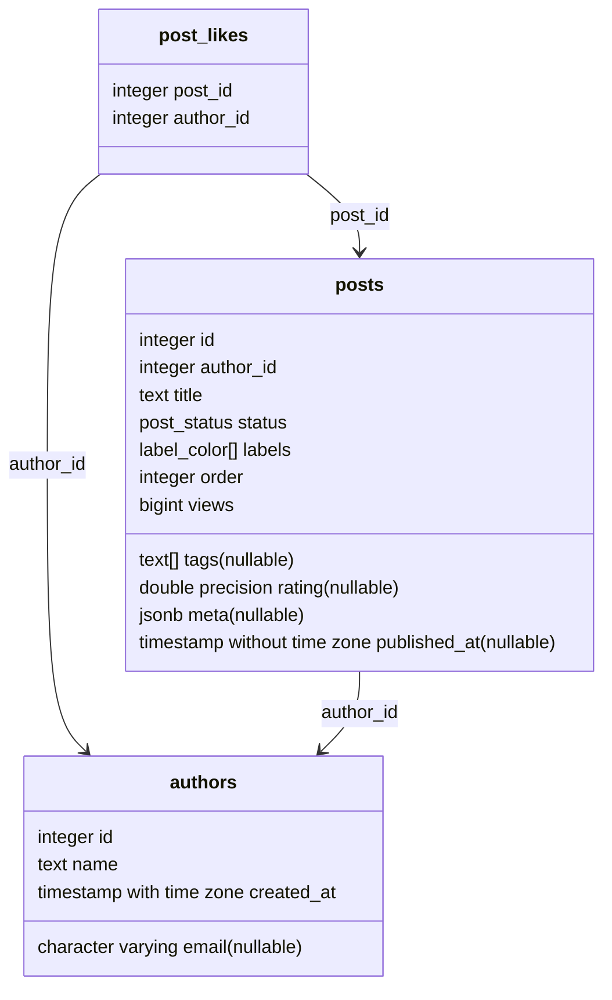

```mermaid
classDiagram
class authors {
  integer id
  text name
  character varying email (nullable)
  timestamp with time zone created_at
}
class post_likes {
  integer post_id
  integer author_id
}
class posts {
  integer id
  integer author_id
  text title
  post_status status
  label_color[] labels
  text[] tags (nullable)
  integer order
  bigint views
  double precision rating (nullable)
  jsonb meta (nullable)
  timestamp without time zone published_at (nullable)
}
post_likes --> authors : author_id
post_likes --> posts : post_id
posts --> authors : author_id
```
